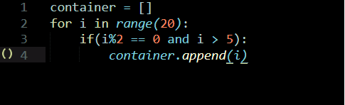
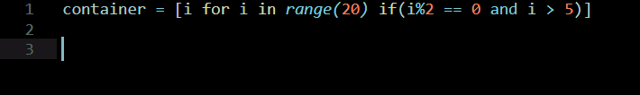

# Wizardpy
**Python to pythonic code converter, get the most out of your code**

Why to write extra lines.

     
when it could be done effeciently with a single line.

## Installation

>Requires Python 3.0 or higher.

 **MacOS and Windows.**
 
`$ pip install wizardpy`

**or apt-get if you're using Linux:**

`$ sudo apt-get install wizardpy`

## Usage

Wizardpy is a command-line tool to optimize python code speed and format by detecting common harmful behaviours.

## Technology

The application works mainly on regular expressions by dectecting harmful code pattern and replacing it with an optimal equivalent.
Wizardpy works on python built-in packages, there's no extra dependences you need to install.

